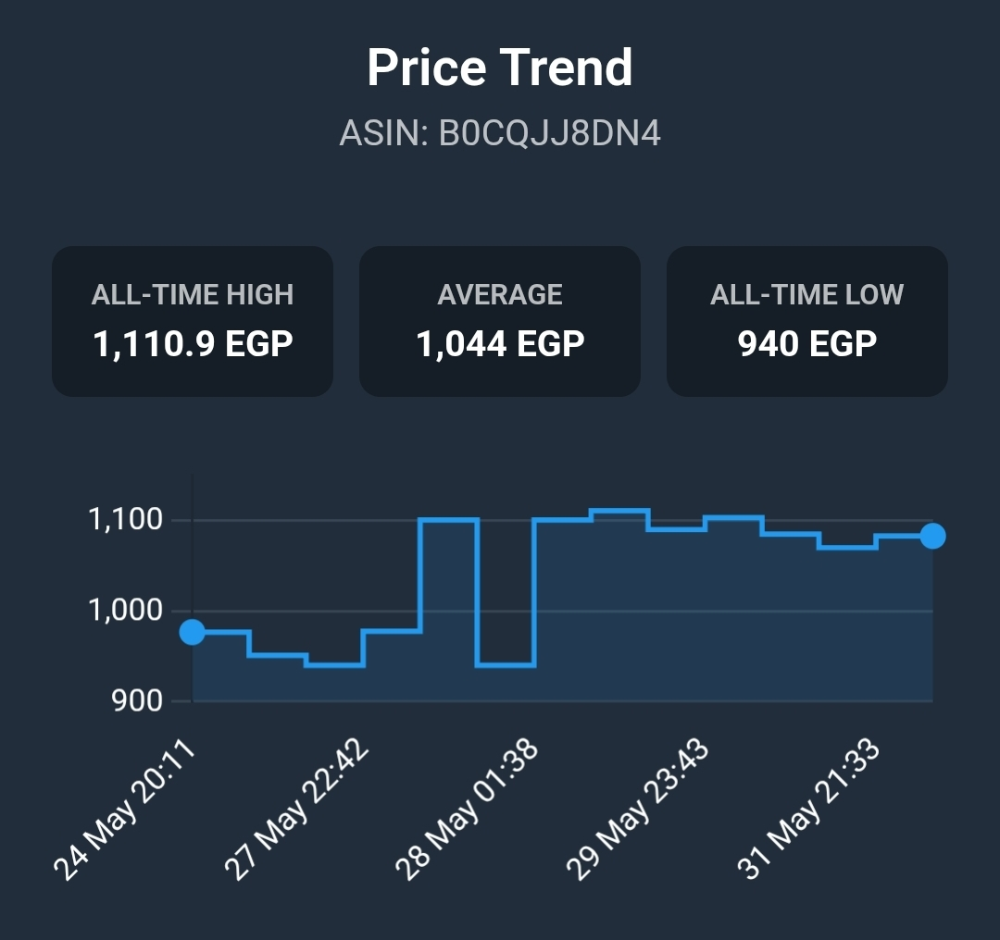
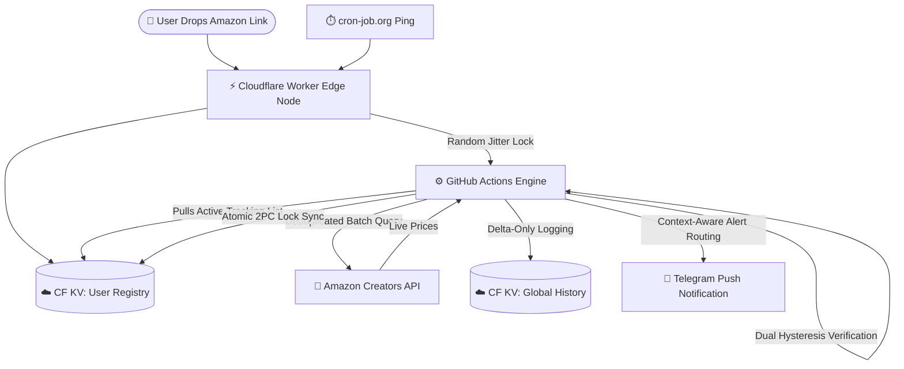

  
# 📉 AzTracker 
### The Serverless Amazon.eg Price Engine

> A highly scalable, multi-tenant price tracking architecture built on Cloudflare KV and GitHub Actions. It features an interactive ChatOps UI, dual-hysteresis anti-flap protection, and a crowdsourced "Hivemind" pricing database.

🔗 **Try the Bot:** [@AzTrackerr_bot](https://t.me/AzTrackerr_bot)

---

## 🚀 Key Engineering Achievements

### 🛡️ The Dual-Hysteresis "Anti-Flap" Engine
Amazon's PA-API frequently truncates payloads under heavy load, falsely reporting items as "Out of Stock." AzTracker implements a 16-run (two-hour) Hysteresis memory buffer. It artificially holds the last known good price through API glitches, eliminating false-positive "Restock" spam and ensuring users only receive alerts for verified state changes.

### ⚛️ Atomic Two-Phase Commit (2PC) Synchronization
To prevent TOCTOU (Time-Of-Check to Time-Of-Use) race conditions across the distributed Cloudflare KV edge network, the Python engine utilizes an atomic Two-Phase Commit. It executes webhooks synchronously, merges Telegram delivery locks with backend tracking resets into a single state array, and pushes the synchronized payload in one parallel execution to guarantee database consensus.

### 📦 Smart Alternatives & Hidden Warehouse Deals
AzTracker doesn't just track the Buy Box. It parses complex condition sub-schemas to unearth hidden "Amazon Resale" (Used/Warehouse) deals. The engine routes these discoveries to a dynamic, context-aware Telegram UI, rendering specialized checkout buttons (🛒 vs 📦) based on the exact condition of the targeted deal.

### 📉 Delta-Only Time-Series Logging
Storing 96 identical price checks a day per product would destroy KV performance. AzTracker implements a "Delta-Logger" that strictly writes to the database *only* when a price shifts. 
* Limits array sizes to the last 150 price changes (up to ~3 years of historical fluctuations).
* Keeps historical payloads under **4.6 KB**, guaranteeing sub-10ms read times at the edge.

### 📊 Edge-Rendered Mini App Analytics
Instead of rendering static images or text ledgers, AzTracker intercepts Telegram's Native Web App triggers. The Cloudflare Worker acts as a web server, instantly rendering a beautiful, interactive `Chart.js` price graph that matches the user's native Telegram Dark/Light theme, seamlessly handling `null` gaps for officially Out-of-Stock periods.

### 🎲 Dynamic Jitter Scheduling
To prevent fixed-minute execution patterns (and subsequent API rate-limiting), the Cloudflare Worker intercepts a per-minute cron ping and generates randomized execution slots (`randInt`) inside each hour. It uses Cloudflare's in-memory Cache API as a distributed lock to dispatch the GitHub Actions engine unpredictably, mimicking natural human traffic.

---

## 🛠️ Architecture Pipeline

---

## ✨ System Features

* 👥 **Multi-Tenant VIP Access:** Isolated tracking databases for approved users.
* 🛡️ **Role-Based Admin Panel:** Built-in ChatOps approval system to manage guests, revoke access, or promote admins entirely through inline buttons.
* 🎯 **Strict Boolean Target Locks:** Users set specific budgets. The engine features zero-spam target locks—alerting exactly once upon matching the target price and remaining silent until the price rebounds or sells out.
* 📦 **Deduplicated Batch Processing:** 10 users tracking the same item triggers only 1 API request. Batches of 10 items are sent simultaneously to deeply optimize API limits.
* 📱 **Mobile Deep-Link Extraction:** Automatically resolves `amzn.to` and `amzn.eu` short links shared directly from the Amazon mobile app.
* 🚨 **Automated Crash Reporting:** Fatal workflow exceptions push full tracebacks directly to Root Admins via Telegram.

---

## ⚙️ Deployment & Infrastructure

AzTracker relies on a fully automated GitOps pipeline. 

1. **The Edge Node:** `worker.js` handles all UI rendering, routing, user authorization, Web App serving, and the randomized scheduler logic. It is deployed to Cloudflare via GitHub Actions upon any push to `main`.
2. **The Processing Engine:** `price_tracker.py` wakes up via a `repository_dispatch`, handles the heavy multi-tenant array processing, performs the Amazon API batch requests, executes the Hysteresis validation, and dispatches Telegram alerts. 
3. **The Database:** A single Cloudflare KV namespace (`AZTRACKER_DB`) acts as the state manager, execution lock, user registry, and global price history ledger.

*(See the [Deployment Guide](docs/DEPLOYMENT.md) for full step-by-step setup and quick-start instructions).*

---

## 👨‍💻 Architect & Acknowledgements

Engineered and maintained by **Khalid Ibrahim**.

Special thanks to **[Abdelrahman Elkhayat](https://www.facebook.com/bodaa.elkhayat)** for generously providing the Amazon Creators API credentials that power the core tracking engine.

Built with assistance from:
* [Claude](https://claude.ai) by Anthropic
* [Gemini](https://gemini.google.com) by Google
* [ChatGPT](https://chatgpt.com) by OpenAI

---

## 🗺️ Future Development
*Check out the [Architecture Roadmap](docs/ROADMAP.md) to see planned features and tech debt resolutions.*

---

## License
MIT — free to use, modify, and distribute.
