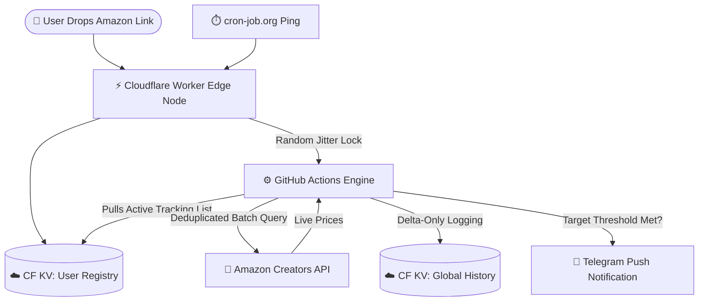

<div align="center">
  
# 📉 AzTracker 
### The Serverless Amazon.eg Price Engine

> 🛑 **PROJECT STATUS NOTICE:** In light of the May 2026 GitHub internal codebase supply-chain incident involving TeamPCP, this repository's background automation has been deliberately frozen. Out of an abundance of caution, all integration tokens, API keys, and database secrets have been completely revoked and zeroed out. The project and its associated Telegram bot will remain offline indefinitely while infrastructure security is re-evaluated. No timeline for restoration is currently set.


[](https://workers.cloudflare.com/)
[](https://python.org)
[](https://github.com/features/actions)
[](https://core.telegram.org/bots)

> A highly scalable, multi-tenant price tracking architecture built on Cloudflare KV and GitHub Actions. It features an interactive ChatOps UI, edge-rendered analytics, and a crowdsourced "Hivemind" pricing database.

🔗 **Try the Bot:** [@AzTrackerr_bot](https://t.me/AzTrackerr_bot)


</div>

---

## 🚀 Key Engineering Achievements

### 🧠 The Global Hivemind (Crowdsourced Data)
AzTracker decouples user tracking registries from the core price database. If User A tracks a monitor for 6 months, and User B decides to track the same monitor today, User B instantly inherits 6 months of visual price history. The global database gets richer with every product any user adds.

### 📉 Delta-Only Time-Series Logging
Storing 96 identical price checks a day per product would destroy KV performance. AzTracker implements a "Delta-Logger" that strictly writes to the database *only* when a price shifts. 
* Limits array sizes to the last 150 price changes (up to ~3 years of historical fluctuations).
* Keeps historical payloads under **4.6 KB**, guaranteeing sub-10ms read times at the edge.

### 📊 Edge-Rendered Mini App Analytics
Instead of rendering static images or text ledgers, AzTracker intercepts Telegram's Native Web App triggers. The Cloudflare Worker acts as a web server, instantly rendering a beautiful, interactive `Chart.js` price graph that matches the user's native Telegram Dark/Light theme, without ever cluttering the chat history.

### 🎲 Dynamic Jitter Scheduling
To prevent fixed-minute execution patterns (and subsequent API rate-limiting), the Cloudflare Worker intercepts a per-minute cron ping and generates randomized execution slots (`randInt`) inside each hour. It uses Cloudflare KV as a distributed lock to dispatch the GitHub Actions engine unpredictably, mimicking natural human traffic.

### 🧹 Zero-Clutter SPA Interface
The Telegram bot functions as a Single-Page Application. Ghost inputs, old commands, and raw Amazon links are instantly vaporized upon processing. Pagination is handled dynamically in-place, keeping the user's chat history pristine and purely button-driven.

### 🧠 Dirty State Write Optimization
To bypass Cloudflare KV's strict daily write limits, the Python engine implements a "dirty state" tracker. It strictly monitors the state machine of each user's profile and only executes a database `PUT` request if a user's tracking parameters (like an `alert_sent` flag) physically changed during that specific execution minute, resulting in near-zero wasted database writes.

---

## 🛠️ Architecture Pipeline



---

## ✨ System Features

* 👥 **Multi-Tenant VIP Access:** Isolated tracking databases for approved users.
* 🛡️ **Role-Based Admin Panel:** Built-in ChatOps approval system to manage guests, revoke access, or promote admins entirely through inline buttons.
* 👁️ **Admin God Mode:** Remotely inspect, pause, or force-delete items from any user's active registry.
* 🎯 **Target Price Thresholds:** Users set specific budgets. The engine filters out minor fluctuations and only pushes notifications when the deal hits their exact target.
* 📦 **Deduplicated Batch Processing:** 10 users tracking the same item triggers only 1 API request. Batches of 10 items are sent simultaneously to deeply optimize API limits.
* 📱 **Mobile Deep-Link Extraction:** Automatically resolves `amzn.to` and `amzn.eu` short links shared directly from the Amazon mobile app.
* 🚨 **Automated Crash Reporting:** Fatal workflow exceptions push full tracebacks directly to Root Admins via Telegram.

---

## ⚙️ Deployment & Infrastructure

AzTracker relies on a fully automated GitOps pipeline. 

1. **The Edge Node:** `worker.js` handles all UI rendering, routing, user authorization, Web App serving, and the randomized scheduler logic. It is automatically compiled and deployed to Cloudflare via GitHub Actions upon any push to `main`.
2. **The Processing Engine:** `price_tracker.py` wakes up via a `repository_dispatch`, handles the heavy multi-tenant array processing, performs the Amazon API batch requests, logs the deltas, and dispatches Telegram alerts. 
3. **The Database:** A single Cloudflare KV namespace (`AZTRACKER_DB`) acts as the state manager, execution lock, user registry, and global price history ledger.

---

## 🚀 Quick Start Guide

### What You'll Need

* A [GitHub](https://github.com) account
* A [Cloudflare](https://dash.cloudflare.com/) account (Free tier)
* A [Telegram](https://telegram.org) account
* An Amazon Associates account with Creators API access
* A [cron-job.org](https://cron-job.org) account (Free)

---

### Step 1 — Setup Telegram & The Repo

1. Fork or clone this repository.
2. Open Telegram, search **@BotFather**, send `/newbot`, and copy the **Bot Token**.
3. Search **@userinfobot**, send `/start`, and copy your personal **Telegram ID**.
4. *(Optional)* In @BotFather, use `/setcommands` and add:

```text
start - Open Control Center
```

---

### Step 2 — Setup Cloudflare KV & Wrangler Configuration

1. Log into Cloudflare → **Storage & Databases** → **KV** → Create a namespace called `AZTRACKER_DB`.
2. Copy the Namespace ID.
3. Go to **Workers & Pages** → Create a Worker named:

```text
aztracker-bot
```

4. Open `wrangler.toml` and configure:

```toml
[vars]
GITHUB_OWNER = "your-github-username"
GITHUB_REPO = "AzTracker"
```

5. Configure your KV Namespace ID in `wrangler.toml`.

---

### Step 3 — Get Amazon Creators API Credentials

1. Log in at [affiliate-program.amazon.eg](https://affiliate-program.amazon.eg)
2. Navigate to:

```text
Tools → Creators API
```

3. Generate:

   * Access Key
   * Secret Key
   * Partner Tag
   * API Version

---

### Step 4 — Configure GitHub Secrets

Go to:

```text
Settings → Secrets and variables → Actions
```

Add the following:

| Secret               | Value                                                      |
| -------------------- | ---------------------------------------------------------- |
| `TELEGRAM_TOKEN`     | From @BotFather                                            |
| `ALLOWED_USERS`      | Your Root Admin Telegram ID                                |
| `AMAZON_ACCESS_KEY`  | Amazon Creators API Access Key                             |
| `AMAZON_SECRET_KEY`  | Amazon Creators API Secret Key                             |
| `AMAZON_PARTNER_TAG` | Amazon Associates Tag                                      |
| `AMAZON_API_VERSION` | API Version                                                |
| `CF_ACCOUNT_ID`      | Cloudflare Account ID                                      |
| `CF_NAMESPACE_ID`    | Cloudflare KV Namespace ID                                 |
| `CF_API_TOKEN`       | Cloudflare API Token                                       |
| `GITHUB_PAT`         | GitHub Personal Access Token used for workflow dispatching |
| `SCHEDULER_SECRET`   | Secret protecting the hidden `/scheduler` endpoint         |

---

### Step 5 — Set Up the Scheduler

Use [cron-job.org](https://cron-job.org) to ping your Worker every minute.

Method:

```text
GET
```

URL:

```text
https://YOUR_WORKER.workers.dev/scheduler?key=YOUR_SCHEDULER_SECRET
```

Schedule:

```text
Every minute
```

The Worker internally decides whether the current minute should dispatch GitHub Actions.

#### Recommended Alternative Authentication

Instead of exposing the secret in the query string, cron-job.org can send:

```http
x-scheduler-key: YOUR_SCHEDULER_SECRET
```

---

## 👨‍💻 Architect & Acknowledgements

Engineered and maintained by **Khalid Ibrahim**.

Special thanks to **[Abdelrahman Elkhayat](https://www.facebook.com/bodaa.elkhayat)** for generously providing the Amazon Creators API credentials that power the core tracking engine.


Built with assistance from:
* [Claude](https://claude.ai) by Anthropic
* [Gemini](https://gemini.google.com) by Google
* [ChatGPT](https://chatgpt.com) by OpenAI

---

## 🗺️ Future Development
*Check out the [v2.0 Architecture Roadmap](ROADMAP.md) to see planned features and tech debt resolutions.*

---

## License

MIT — free to use, modify, and distribute.
