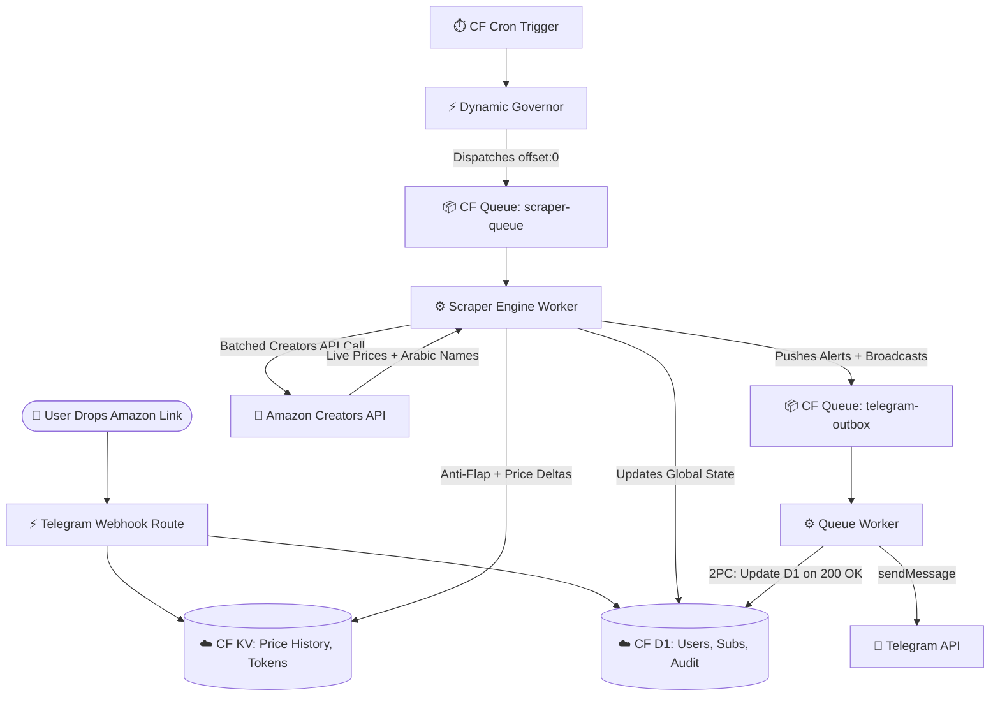

<div align="center">


### The Serverless Amazon.eg Price Engine

[](https://workers.cloudflare.com/)
[](https://developer.mozilla.org/en-US/docs/Web/JavaScript)
[](https://developers.cloudflare.com/d1/)
[](https://developers.cloudflare.com/kv/)
[](https://core.telegram.org/bots)

> A highly scalable, multi-tenant price tracking architecture built purely on Cloudflare Workers, D1 SQL, and Queues. It features a fully localized (English/Egyptian Arabic) interactive Admin CRM Web App, dual-hysteresis anti-flap protection, and dynamic queue-based scheduling.

🔗 **Try the Bot:** [@AzTrackerr_bot](https://t.me/AzTrackerr_bot)

📢 **Live Demo (Public Deals Channel):** [@AzTrackerr](https://t.me/AzTrackerr)


</div>

---

## 🚀 Key Engineering Achievements

### 🗄️ Hybrid Database Architecture (D1 + KV)
AzTracker strictly separates relational state from time-series telemetry. **Cloudflare D1 (SQLite)** handles all user tracking, subscriptions, concurrency locks, audit logs, and the Hysteresis Engine. **Cloudflare KV** serves as a NoSQL document store for massive time-series arrays and cached Amazon access tokens, avoiding database read-exhaustion.

### 🛡️ Edge-Rendered CRM & SIEM Auditing
The Admin Panel opens an edge-rendered, Tailwind-styled Command Center Web App served directly from the Worker. It features full **RTL/LTR dual-localization (English and Egyptian Arabic)**. Authentication uses Telegram Web App `initData` verified via HMAC-SHA256. The `/audit` route serves a forensic SIEM ledger page for all admin actions.

### ⚛️ Decoupled Async Message Delivery
Telegram alerts are decoupled from the main scraper engine using Cloudflare Queues (`telegram-outbox`). The queue worker implements a Two-Phase Commit (2PC) that prevents duplicate alerts by updating D1 flags only upon a successful HTTP 200 Telegram delivery. Failed deliveries trigger automatic retry with exponential backoff.

### 📉 Distributed Scraping with Dynamic Governor Logic
The scraper engine processes products in batches of 10 via Cloudflare Queues (`scraper-queue`). A dynamic Governor in the cron trigger calculates optimal batch sizes and distribution intervals based on the total active subscription pool.

---

## 🛠️ Architecture Pipeline



---

## ⚙️ V2 Modular Architecture (ES6)

The application is structured completely around an ES6 module design pattern under `src/`, eliminating massive monolithic files and promoting logical separation of concerns.

### Directory Structure

```text
src/
├── index.js                 # Worker Entry Point (fetch, queue, scheduled)
├── api/
│   └── amazon.ts            # TypeScript Amazon Creators API interfaces
├── core/
│   ├── amazon.js            # Amazon Creators API Client & Parser
│   ├── db.js                # D1 Database Operations & Audit Logging
│   ├── i18n.js              # Localization Engine (English & Egyptian Arabic)
│   ├── telegram.js          # Telegram API SDK Wrapper
│   └── utils.js             # Shared Utilities (Formatting, Time, Delay)
├── routes/
│   ├── crm_dashboard.js     # Admin CRM Web App & API Endpoints
│   └── telegram_webhook.js  # Telegram Bot Command & Callback Router
└── workers/
    ├── cron_trigger.js      # Dynamic Governor & D1 Garbage Collection
    ├── queue_worker.js      # Consumer for Telegram Outbox & Scraper Engine
    └── scraper_engine.js    # Core Price Evaluation & Anti-Flap Hysteresis
```

### 🚏 Core Routes (`src/routes/`)
All HTTP requests are routed by the `fetch` handler in `src/index.js` to their appropriate domain:
- `POST /webhook/*`: Sent to `telegram_webhook.js` for ChatOps interaction.
- `GET /crm`, `GET /audit`, `GET /api/*`, `POST /api/*`: Sent to `crm_dashboard.js` to serve the Admin UI and API.

### 🔧 Core Modules (`src/core/`)
State-agnostic libraries used universally:
- `amazon.js`: Native JS execution for Amazon's Creators API token management and schema parsing.
- `db.js`: Contains shared D1 operations like role verification and audit logging.
- `telegram.js`: Native REST wrapper over Telegram's Bot API.
- `i18n.js`: Comprehensive string resolution dictionaries supporting English (en) and Egyptian Arabic (masry), complete with emoji layout adjustments.
- `utils.js`: Helpers for EGP currency formatting, HTML escaping, and time manipulation.

### 🔄 Background Jobs (`src/workers/`)
Decoupled logic for queue consumers and crons:
- `scraper_engine.js`: The complex business logic that queries the Amazon API, applies hysteresis timers, checks bounds against User Subscriptions, updates KV price histories, and enqueues alerts.
- `queue_worker.js`: Cloudflare Queue consumer for both `scraper-queue` (for triggering the scraper engine) and `telegram-outbox` (for delivering alerts reliably via 2PC).
- `cron_trigger.js`: Generates the dynamic interval calculations and issues the first batch of scrapes.

---

## 🔑 Environment Variables & Secrets

### Plaintext Variables (set in `wrangler.toml` `[vars]`)

| Variable | Description |
|----------|-------------|
| `DEFAULT_USER_PRODUCT_LIMIT` | Global limit on concurrent tracks per user (default: `"3"`). |
| `GITHUB_OWNER` | GitHub owner for the project. |
| `GITHUB_REPO` | GitHub repository name. |

### Secrets (must be injected via `wrangler secret put`)

| Variable | Description |
|----------|-------------|
| `TELEGRAM_BOT_TOKEN` | Telegram Bot API token. |
| `TELEGRAM_WEBHOOK_SECRET` | Secret token to validate incoming Telegram webhook requests and CRM auth. |
| `TELEGRAM_ROOT_ADMIN_IDS` | Comma-separated list of root-level Telegram user IDs. |
| `AMAZON_CLIENT_ID` | Amazon Creators API Credential ID. |
| `AMAZON_CLIENT_SECRET` | Amazon Creators API Secret. |
| `AMAZON_PARTNER_TAG` | Amazon Associates Tracking ID for product URLs. |
| `AMZN_ASSOCIATES_TAG` | Amazon Associates Tracking ID for the Creators API payload. |
| `TELEGRAM_PUBLIC_CHANNEL_ID` | Target channel ID for automated deal broadcasting. |

### Cloudflare Bindings (configured in `wrangler.toml`)

| Binding | Type | Purpose |
|---------|------|---------|
| `DB` | D1 Database | Relational models. |
| `AZTRACKER_DB` | KV Namespace | Time-series metrics and tokens. |
| `MESSAGE_QUEUE` | Queue Producer | Pushes alerts to `telegram-outbox`. |
| `SCRAPER_QUEUE` | Queue Producer | Pushes offsets to `scraper-queue`. |

---

## 👨‍💻 Architect & Acknowledgements

Engineered and maintained by **Khalid Ibrahim**, built upon core cloud infrastructure and system architecture principles.

Special thanks to **[Abdelrahman Elkhayat](https://www.facebook.com/bodaa.elkhayat)** for generously providing the Amazon Creators API credentials that power the core tracking engine.
