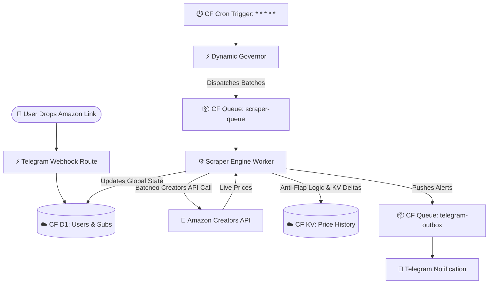

### The Serverless Amazon.eg Price Engine

> A highly scalable, multi-tenant price tracking architecture built purely on Cloudflare Workers, D1 SQL, and Queues. It features an interactive ChatOps UI, dual-hysteresis anti-flap protection, and dynamic queue-based scheduling.

🔗 **Try the Bot:** [@AzTrackerr_bot](https://t.me/AzTrackerr_bot)

📢 **Live Demo (Public Deals Channel):** [@AzTrackerr](https://t.me/AzTrackerr)

---

## 🚀 Key Engineering Achievements

### 🛡️ The Time-Based Hysteresis "Anti-Flap" Engine
Amazon's Creators API frequently truncates payloads under heavy load, falsely reporting items as "Out of Stock." AzTracker implements a D1-backed time-based Hysteresis buffer. It artificially holds the last known good price through API glitches, eliminating false-positive "Restock" spam.

### ⚛️ Decoupled Async Message Delivery
To prevent race conditions and ensure optimal reliability, Telegram alerts are decoupled from the main scraper engine using Cloudflare Queues (`telegram-outbox`). The Telegram delivery worker uses an atomic lock that updates the database only on a successful 200 OK delivery.

### 📦 Smart Alternatives & Hidden Warehouse Deals
AzTracker parses complex condition sub-schemas from the Amazon Creators API to unearth hidden "Amazon Resale" (Used/Warehouse) deals. The engine routes these discoveries to a dynamic, context-aware Telegram UI, rendering specialized checkout buttons based on the exact condition.

### 📉 Distributed Scraping with Dynamic Governor Logic
To prevent API rate-limiting, the scraper engine utilizes Cloudflare Queues (`scraper-queue`) with recursive triggering. A dynamic Governor script calculates the optimal batch sizes and distribution based on the total active user pool, ensuring requests are perfectly distributed across the hour.

### 📊 Edge-Rendered Mini App Analytics
AzTracker intercepts Telegram's Native Web App triggers and acts as a web server (`/crm`), instantly rendering a beautiful, interactive `Chart.js` price graph. It pulls historical payload data from Cloudflare KV and combines it with relational metadata from Cloudflare D1.

---

## 🛠️ Architecture Pipeline

---

## ✨ System Features

* 👥 **Automated Join Queue:** Built-in ChatOps approval pipeline to manage guests safely, protected against "Thundering Herd" race conditions with a strict depth limit.
* 🕵️ **Web App SIEM Ledger:** A forensic audit log (`/api/crm/audit`) tracking all root administrative actions.
* 🌍 **Dynamic Geofencing:** Automatically parses incoming links and hard-rejects non-supported regions (locking the database securely to `amazon.eg`).
* 🎯 **Strict Boolean Target Locks:** Users set specific budgets. The engine features zero-spam target locks—alerting exactly once upon matching the target price.
* 📦 **Deduplicated Batch Processing:** 10 users tracking the same item triggers only 1 API request.

---

## ⚙️ Routing Logic & Architecture

The application is structured entirely using ES6 Modules within the `src/` directory, exporting fetch and queue handlers through `src/index.js`.

### 🚏 Core Routes (`src/index.js` & `src/routes/`)
- `POST /webhook/*`: Serves the primary Telegram Bot interface and ChatOps logic (`telegram_webhook.js`).
- `GET /crm`: Serves the secure administrative web app and charting UI (`crm_dashboard.js`).
- `GET /api/crm/data` & `GET /api/crm/history/*`: Hydrates the frontend dashboard with live D1/KV data.
- `POST /api/crm/action`: Administrative mutations (approving users, deleting data).
- `GET /audit` & `GET /api/audit`: Cryptographically signed routes for SIEM access.

### 🔄 Background Jobs (`src/workers/`)
- **`cron_trigger.js`**: Triggered by Cloudflare's `* * * * *` and `0 0 * * *` cron jobs. Manages D1 garbage collection and dynamically calculates scraping velocity using the active subscription pool. Dispatches initial jobs to the scraper queue.
- **`scraper_engine.js`**: Core Creators API consumer. Processes database chunks, evaluates complex condition logic, pushes history to KV, and determines alert priority.
- **`queue_worker.js`**: Consumer for both `scraper-queue` and `telegram-outbox`. Ensures stable delivery and exponential backoff retry for Telegram rate limits.

---

## 🔑 Environment Variables & Secrets

The engine requires the following critical variables injected via `wrangler.toml` or Cloudflare Secrets:

| Variable | Description |
|----------|-------------|
| `TELEGRAM_BOT_TOKEN` | Your Telegram Bot API token. |
| `TELEGRAM_WEBHOOK_SECRET` | Security token to validate incoming Telegram webhook requests. |
| `TELEGRAM_ROOT_ADMIN_IDS` | Comma-separated list of root-level Telegram user IDs. |
| `AMAZON_CLIENT_ID` | Amazon Creators API Credential ID. |
| `AMAZON_CLIENT_SECRET` | Amazon Creators API Secret. |
| `AMAZON_PARTNER_TAG` | Your Amazon Associates Tracking ID for Product URLs. |
| `AMZN_ASSOCIATES_TAG` | Your Amazon Associates Tracking ID for the Creators API Payload. |
| `DEFAULT_USER_PRODUCT_LIMIT` | Global limit on concurrent tracks per user. |
| `TELEGRAM_PUBLIC_CHANNEL_ID` | (Optional) Target ID for automated Deal Broadcasting. |

---

## 📡 Advanced Feature: Omnichannel Broadcast (Optional)

AzTracker includes a hidden, opt-in feature to automatically run a public Deals Channel. The engine evaluates every tracked item, calculates standard deviation, and triggers alerts for anomalous drops (Z-Score anomaly of **$z \le -1.5$** paired with a **$\ge 15\%$** absolute price drop). 

Simply configure the `TELEGRAM_PUBLIC_CHANNEL_ID` environment variable, ensure your bot is an Administrator, and the engine handles the rest.

---

## 👨‍💻 Architect & Acknowledgements

Engineered and maintained by **Khalid Ibrahim**, built upon core cloud infrastructure and system architecture principles.

Special thanks to **[Abdelrahman Elkhayat](https://www.facebook.com/bodaa.elkhayat)** for generously providing the Amazon Creators API credentials that power the core tracking engine.

Built with assistance from:
* [Gemini](https://gemini.google.com) by Google
* [Claude](https://claude.ai) by Anthropic
* [ChatGPT](https://chatgpt.com) by OpenAI

---

## License
MIT — free to use, modify, and distribute.
