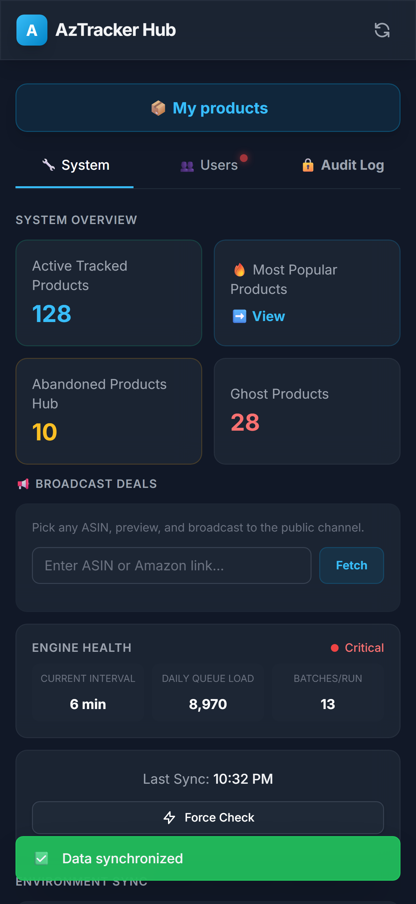
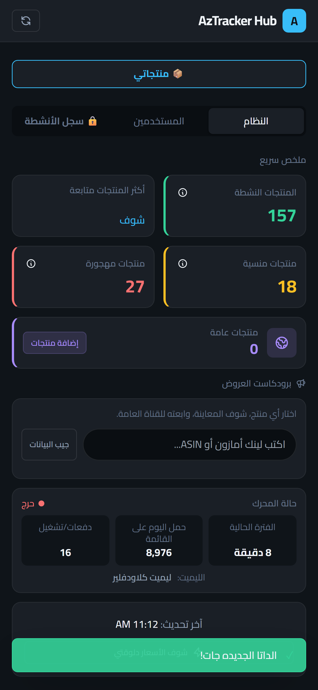
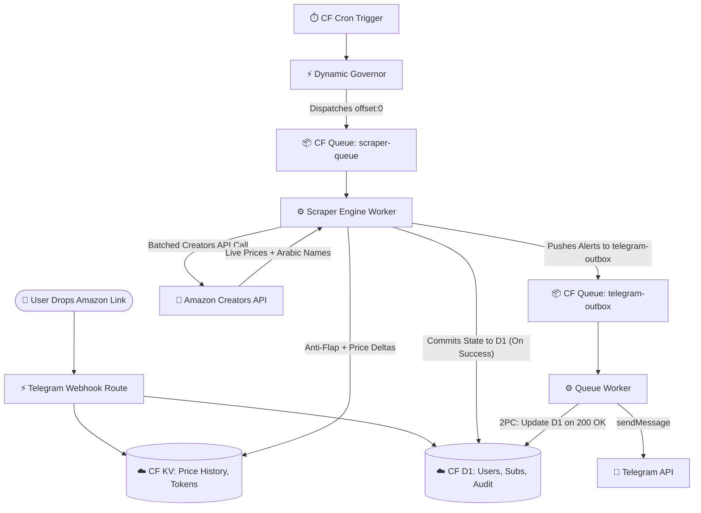

<div align="center">


### The Serverless Amazon.eg Price Engine

[](https://workers.cloudflare.com/)
[](https://developer.mozilla.org/en-US/docs/Web/JavaScript)
[](https://developers.cloudflare.com/d1/)
[](https://developers.cloudflare.com/kv/)
[](https://core.telegram.org/bots)

> A highly scalable, multi-tenant price tracking architecture built purely on Cloudflare Workers, D1 SQL, and Queues. It features a fully localized (English/Egyptian Arabic) interactive Admin CRM Web App, dual-hysteresis anti-flap protection, and dynamic queue-based scheduling.

🔗 **Try the Bot:** [@AzTrackerr_bot](https://t.me/AzTrackerr_bot)

📢 **Live Demo (Public Deals Channel):** [@AzTrackerr](https://t.me/AzTrackerr)


</div>

## 🖼️ Web App CRM Gallery

AzTracker features a securely embedded Telegram WebApp CRM that natively supports both LTR (English) and RTL (Masry/Arabic) modes out-of-the-box.

<table>
  <thead>
    <tr>
      <th width="50%">LTR (English)</th>
      <th width="50%">RTL (Masry / Arabic)</th>
    </tr>
  </thead>
  <tbody>
    <tr>
      <td width="50%" align="center"><a href="docs/GALLERY.md"></a></td>
      <td width="50%" align="center"><a href="docs/GALLERY.md"></a></td>
    </tr>
  </tbody>
</table>

👉 **[View Full Screenshot Gallery](docs/GALLERY.md)**  
*(Contains side-by-side LTR/RTL comparisons of all 20 interactive views, drawers, and charts!)*

---

## 🚀 Key Engineering Achievements

### 🗄️ Hybrid Database Architecture (D1 + KV)
AzTracker strictly separates relational state from time-series telemetry. **Cloudflare D1 (SQLite)** handles all user tracking, subscriptions, concurrency locks, audit logs, and the Hysteresis Engine. **Cloudflare KV** serves as a NoSQL document store for massive time-series arrays and cached Amazon access tokens, avoiding database read-exhaustion.

### 🛡️ Edge-Rendered CRM & SIEM Auditing
The Admin Panel opens an edge-rendered, Tailwind-styled Command Center Web App served directly from the Worker. It features full **RTL/LTR dual-localization (English and Egyptian Arabic)**. The CRM seamlessly pulls actual database product thumbnails as fallback-aware product cards. Authentication uses Telegram Web App `initData` verified via HMAC-SHA256. The `/audit` route serves a forensic SIEM ledger page for all admin actions.

### ⚛️ Decoupled Async Message Delivery
Telegram alerts are decoupled from the main scraper engine using Cloudflare Queues (`telegram-outbox`). The queue worker implements a Two-Phase Commit (2PC) that prevents duplicate alerts by updating D1 flags only upon a successful HTTP 200 Telegram delivery. Failed deliveries trigger automatic retry with exponential backoff.

### 📉 Distributed Scraping & AIMD Auto-Tuning Governor
The scraper engine processes products in batches of 10 via Cloudflare Queues (`scraper-queue`). A **True Dynamic Dual-Governor** calculates the maximum possible polling speed by comparing the Cloudflare `DAILY_QUEUE_LIMIT` against the Amazon Creators API daily quota (8,640 requests/day), strictly throttling to the lowest bottleneck. 

To maximize throughput without hitting 429 blackouts, the engine utilizes a **TCP AIMD (Additive Increase / Multiplicative Decrease) algorithm**. Every night at midnight UTC, it executes a "Slow Start" (+50% jump) or "Congestion Avoidance" (+5% crawl) probe to safely test API headroom. If a hard 429 quota exhaustion is detected, the governor applies a 10% penalty slap and transitions the entire engine into a deep **hibernation state** until exactly Midnight UTC, completely eliminating wasted executions.

### 📱 User Web App Dashboard & Hot Deals Discovery
The standard user product management has been fully upgraded to an interactive Telegram Web App, sharing the same secure HMAC-SHA256 edge-rendering architecture as the admin CRM. It introduces a global **Hot Deals (🔥 عروض نار)** tab that allows standard users to effortlessly discover massive price drops dynamically detected by the engine. Additionally, an intelligent HTTP fallback scraper guarantees perfect cross-lingual localization, while a dynamic viewport engine applies specialized typography scaling (e.g., Cairo font) to equalize Arabic and English UI layouts. To protect against edge scraping and abuse, all Web App endpoints and the global fallback router are secured by **IP-based Rate Limiting**, while a global fetch handler suppresses unhandled errors (Error 1101) to prevent secure worker URL leaks.

### 🧟 Abandoned Products Hub & API-Safe Global Hijacking
The CRM replaces traditional user-level product pausing with an intelligent **Abandoned Products Hub** that securely catalogs orphaned items (products with 0 active users). Admins can utilize a seamless UI toggle to instantly flag any user-discovered product for `always_track` (Keep-Alive) regardless of user abandonment, complete with fluid auto-remove UI animations. The dynamic Cron Governor automatically stretches the global polling interval to absorb thousands of these hijacked products while staying flawlessly under the Cloudflare Queue and Amazon API limits. Furthermore, fetching Arabic titles has been optimized to execute only for genuinely new ASINs, halving overall API consumption.

### ⏱️ Inflation-Resistant Deal Detection (EMA) & Dynamic Buckets
The deal detection engine calculates a **Time-Weighted Average (EMA)** using a 30-day exponential decay half-life, naturally forgetting pre-inflation prices to establish a highly accurate baseline. It evaluates deals using **Dynamic Price Buckets** (e.g., requiring a 15% drop for 100 EGP items, but only a 3% drop for 100,000 EGP laptops), ensuring notifications perfectly mimic human psychological pricing without hardcoded limits.

### 🔗 Omnichannel Direct-Tracking Deep-Links
Omnichannel Telegram broadcast alerts now include a dynamic `https://t.me/AzTrackerr_bot?start=track_{asin}` deep-link. Clicking the "🎯 Track Deal" button opens the bot and triggers a fallback payload router that automatically subscribes the user to the product with zero friction.

### 🗺️ Persistent Menu & Edge Navigation Resilience
The bot utilizes the native Telegram API to provision a bilingual Persistent Menu (`/lang`, `/help`), entirely replacing legacy inline keyboards. The Web App routing layer enforces strict navigation resilience by bypassing iOS/Android WebKit `history.back()` traps using absolute URL replacements. To protect against layout flashing during authentication, the UI deploys a full-screen CSS loader overlay. Additionally, users who block the bot are no longer permanently banned; instead, a graceful HTTP 403 interceptor safely pauses their active subscriptions, preserving their history for instant reactivation.

---

## 🛠️ Architecture Pipeline



---

## ⚙️ V2 Modular Architecture (ES6)

The application is structured completely around an ES6 module design pattern under `src/`, eliminating massive monolithic files and promoting logical separation of concerns.

### Directory Structure

```text
src/
├── index.js                 # Worker Entry Point (fetch, queue, scheduled)
├── core/
│   ├── amazon.js            # Amazon Creators API Client, Parser, and Fallback Web Scraper
│   ├── db.js                # D1 Database Operations, Audit Logging, and Cache API
│   ├── i18n.js              # Localization Engine (English & Egyptian Arabic)
│   ├── telegram.js          # Telegram API SDK Wrapper
│   └── utils.js             # Shared Utilities (Formatting, Time, Delay)
├── routes/
│   ├── crm_dashboard.js     # Admin CRM Web App & API Endpoints
│   ├── telegram_webhook.js  # Telegram Bot Command & Callback Router
│   └── user_dashboard.js    # Public User Hot Deals & Managed Subs Web App
└── workers/
    ├── cron_trigger.js      # Dynamic Governor & D1 Garbage Collection
    ├── queue_worker.js      # Consumer for Telegram Outbox & Scraper Engine
    └── scraper_engine.js    # Core Price Evaluation & Anti-Flap Hysteresis
```

### 🚏 Core Routes (`src/routes/`)
All HTTP requests are routed by the `fetch` handler in `src/index.js` to their appropriate domain:
- `POST /webhook` and `POST /webhook/*`: Sent to `telegram_webhook.js` for ChatOps interaction.
- All other routes (e.g., `GET /crm`, `GET /api/crm/*`, `POST /api/crm/*`): Fall through to `fetchAPI` in `crm_dashboard.js`, which serves both the Edge-Rendered Admin UI and JSON endpoints (handling its own 404s).

### 🔧 Core Modules (`src/core/`)
State-agnostic libraries used universally:
- `amazon.js`: Native JS execution for Amazon's Creators API token management, schema parsing, and a fallback HTTP scraper (`scrapeArabicTitle`) for extracting native Arabic titles from `amazon.eg` pages.
- `db.js`: Contains shared D1 operations like role verification and audit logging, backed by Cloudflare's in-memory Cache API (`caches.default`) to prevent D1 read exhaustion.
- `telegram.js`: Native REST wrapper over Telegram's Bot API.
- `i18n.js`: Comprehensive string resolution dictionaries supporting English (en) and Egyptian Arabic (masry), complete with emoji layout adjustments.
- `utils.js`: Helpers for EGP currency formatting, HTML escaping, and time manipulation.

### 🔄 Background Jobs (`src/workers/`)
Decoupled logic for queue consumers and crons:
- `scraper_engine.js`: The complex business logic that queries the Amazon API, applies hysteresis timers, checks bounds against User Subscriptions, updates KV price histories, and enqueues alerts.
- `queue_worker.js`: Cloudflare Queue consumer for both `scraper-queue` (for triggering the scraper engine) and `telegram-outbox` (for delivering alerts reliably via 2PC).
- `cron_trigger.js`: Generates the dynamic interval calculations and issues the first batch of scrapes.

---

## 📚 Documentation

Detailed documentation for various aspects of the system can be found in the `docs/` directory:

- **[ROADMAP.md](docs/ROADMAP.md)**: Architectural milestones, feature history, and tech debt tracking.
- **[DEPLOYMENT.md](docs/DEPLOYMENT.md)**: Dual-environment infrastructure, deployment workflow, and webhook registration.
- **[TESTING.md](docs/TESTING.md)**: Diagnostic vectors, queue testing protocols, and async execution tests.
- **[GALLERY.md](docs/GALLERY.md)**: Visual tour of the fully localized LTR/RTL CRM Dashboard.

---
## 🔑 Environment Variables & Secrets

### Plaintext Variables (set in `wrangler.toml` `[vars]`)

| Variable | Description |
|----------|-------------|
| `DEFAULT_USER_PRODUCT_LIMIT` | Global limit on concurrent tracks per user (default: `"3"`). |
| `DAILY_QUEUE_LIMIT` | Global limit for queued executions (default: `"10000"`). |
| `AMZN_EG_MERCHANT_ID` | Amazon.eg Retail merchant ID (default: `'A1ZVRGNO5AYLOV'`). |
| `AMZN_RESALE_MERCHANT_ID` | Amazon Resale merchant ID (default: `'A2N2MP47XAP1MK'`). |
| `GITHUB_OWNER` | GitHub owner for the project. |
| `GITHUB_REPO` | GitHub repository name. |

### Cloudflare Secrets (via `wrangler secret put`)

| Variable | Description |
|----------|-------------|
| `TELEGRAM_BOT_TOKEN` | Telegram Bot API token. |
| `TELEGRAM_WEBHOOK_SECRET` | Secret token to validate incoming Telegram webhook requests and CRM auth. |
| `TELEGRAM_ROOT_ADMIN_IDS` | Comma-separated list of root-level Telegram user IDs. |
| `AMAZON_CLIENT_ID` | Amazon Creators API Credential ID. |
| `AMAZON_CLIENT_SECRET` | Amazon Creators API Secret. |
| `AMAZON_PARTNER_TAG` | Amazon Associates Tracking ID for product URLs and the Creators API payload. |
| `TELEGRAM_PUBLIC_CHANNEL_ID` | Target channel ID for automated deal broadcasting. |

### 🔄 Automated CI/CD Database Synchronization
The project features a full CI/CD pipeline using GitHub Actions (`sync-prod-to-dev.yml`). On deployment, it safely mirrors the production D1 databases to the development environment by utilizing `sed` to intelligently transform destructive `INSERT INTO` SQL commands into safe `INSERT OR REPLACE INTO` commands. It simultaneously uses a custom Node.js script to bulk-mirror the Cloudflare KV namespaces, guaranteeing identical environments without breaking dev constraints.

### GitHub Repository Secrets (for CI/CD Actions)

| Variable | Description |
|----------|-------------|
| `CLOUDFLARE_ACCOUNT_ID` | Your Cloudflare Account ID for `deploy_worker.yml` and `sync-prod-to-dev.yml`. |
| `CLOUDFLARE_API_TOKEN` | Custom API Token with `D1 (Edit)`, `Worker Scripts (Edit)`, and `Workers KV Storage (Edit)`. |

### Cloudflare Bindings (configured in `wrangler.toml`)

| Binding | Type | Purpose |
|---------|------|---------|
| `DB` | D1 Database | Relational models. |
| `AZTRACKER_DB` | KV Namespace | Time-series metrics and tokens. |
| `MESSAGE_QUEUE` | Queue Producer | Pushes alerts to `telegram-outbox` (internally logged as `message-queue`). |
| `SCRAPER_QUEUE` | Queue Producer | Pushes offsets to `scraper-queue`. |

---

## 👨‍💻 Architect & Acknowledgements

Engineered and maintained by **Khalid Ibrahim**, built upon core cloud infrastructure and system architecture principles.

Special thanks to **[Abdelrahman Elkhayat](https://www.facebook.com/bodaa.elkhayat)** for generously providing the Amazon Creators API credentials that power the core tracking engine.
