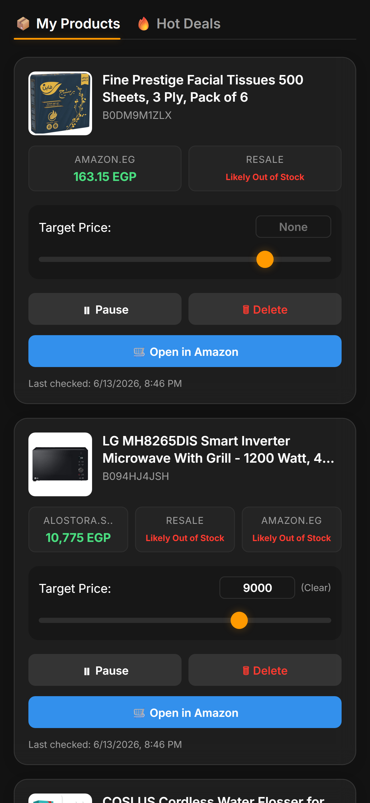
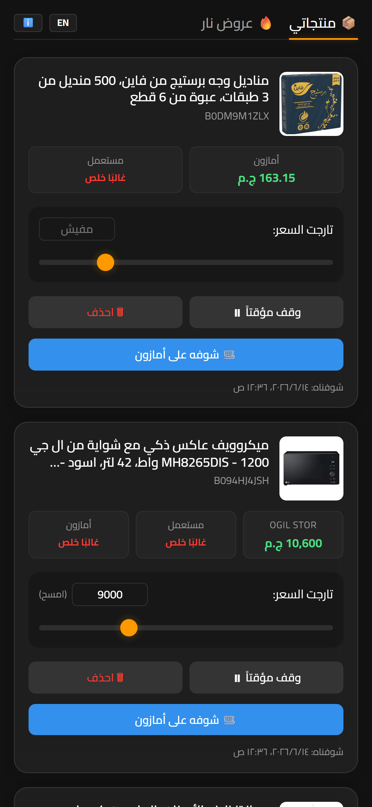
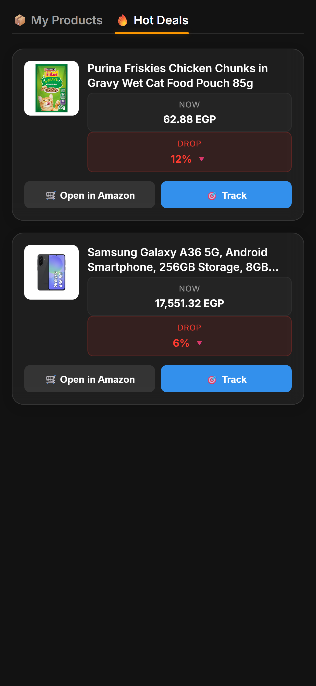
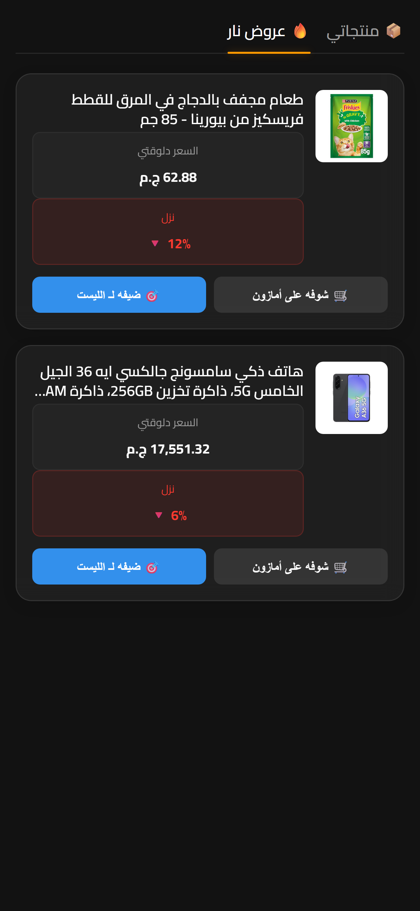

# AzTracker CRM Visual Gallery

AzTracker features a fully localized, responsive, and dynamic CRM Dashboard built without heavy frontend frameworks. It natively supports both **LTR (English)** and **RTL (Masry/Arabic)** layouts with fluid transitions.

Here is a side-by-side comparison of the entire CRM interface in both languages.

<table>
  <thead><tr><th width="20%">View / Feature</th><th width="40%">LTR (English)</th><th width="40%">RTL (Masry / Arabic)</th></tr></thead>
  <tbody>
    <tr>
      <td>**01. Main Dashboard** Overview of system metrics, active watch pool, and quick actions.</td>
      <td align="center"></td>
      <td align="center"></td>
    </tr>
    <tr>
      <td>**02. Approved Users** List of actively enrolled users and their subscription counts.</td>
      <td align="center"></td>
      <td align="center"></td>
    </tr>
    <tr>
      <td>**03. Pending Queue** Users awaiting admin approval to join the tracker.</td>
      <td align="center"></td>
      <td align="center"></td>
    </tr>
    <tr>
      <td>**04. Banned Users** Users whose access has been permanently revoked.</td>
      <td align="center"></td>
      <td align="center"></td>
    </tr>
    <tr>
      <td>**05. System Admins** Users with administrative access (Root vs Admin roles).</td>
      <td align="center"></td>
      <td align="center"></td>
    </tr>
    <tr>
      <td>**06. Security Audit Log** Timeline of all administrative actions.</td>
      <td align="center"></td>
      <td align="center"></td>
    </tr>
    <tr>
      <td>**07. Active Products** Drawer showing all products currently being tracked.</td>
      <td align="center"></td>
      <td align="center"></td>
    </tr>
    <tr>
      <td>**08. Top Charts** Drawer showing most popular products by subscriber count.</td>
      <td align="center"></td>
      <td align="center"></td>
    </tr>
    <tr>
      <td>**09. Paused Products** Items that users have temporarily stopped tracking.</td>
      <td align="center"></td>
      <td align="center"></td>
    </tr>
    <tr>
      <td>**10. Ghost Graveyard** Delisted, out-of-stock, or heavily monitored items.</td>
      <td align="center"></td>
      <td align="center"></td>
    </tr>
    <tr>
      <td>**11. User Profile Items** Drawer displaying individual items tracked by a specific user.</td>
      <td align="center"></td>
      <td align="center"></td>
    </tr>
    <tr>
      <td>**12. Product Subscribers** Drawer showing all users tracking a specific product.</td>
      <td align="center"></td>
      <td align="center"></td>
    </tr>
    <tr>
      <td>**13. Price History Chart** Interactive Chart.js modal showing price trends over time.</td>
      <td align="center"></td>
      <td align="center"></td>
    </tr>
    <tr>
      <td>**14. User Dashboard** The new Telegram Mini App UI showing a user's personal active products.</td>
      <td align="center"></td>
      <td align="center"></td>
    </tr>
    <tr>
      <td>**15. Hot Deals** Curated list of algorithmically detected discounts for the user.</td>
      <td align="center"></td>
      <td align="center"></td>
    </tr>
  </tbody>
</table>

---
*Note: Usernames and Chat IDs have been automatically blurred for privacy.*
