# AzTracker CRM Visual Gallery

AzTracker features a fully localized, responsive, and dynamic CRM Dashboard built without heavy frontend frameworks. It natively supports both **LTR (English)** and **RTL (Masry/Arabic)** layouts with fluid transitions.

Here is a side-by-side comparison of the entire CRM interface in both languages.

| View / Feature | LTR (English) | RTL (Masry / Arabic) |
| :--- | :---: | :---: |
| **01. Main Dashboard** Overview of system metrics, active watch pool, and quick actions. | 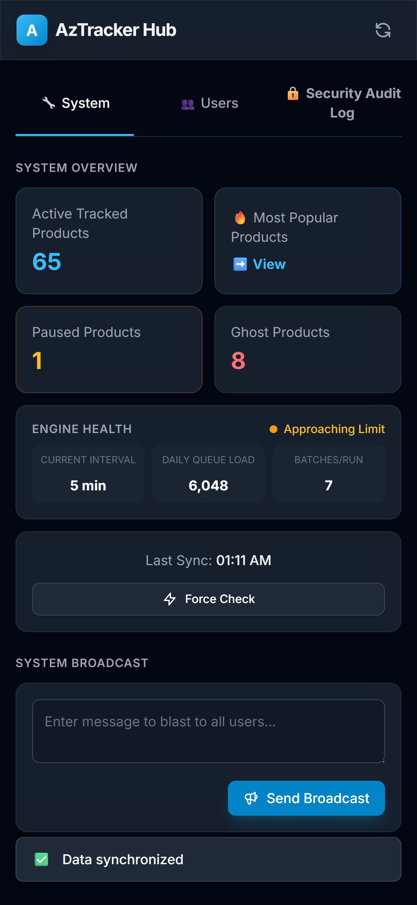 | 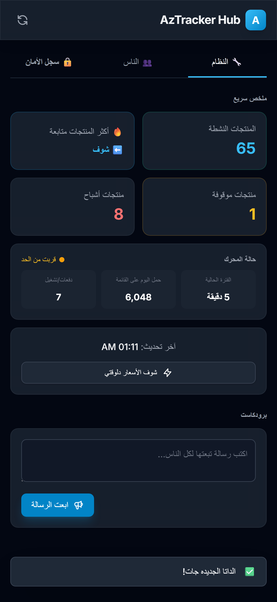 |
| **02. Approved Users** List of actively enrolled users and their subscription counts. | 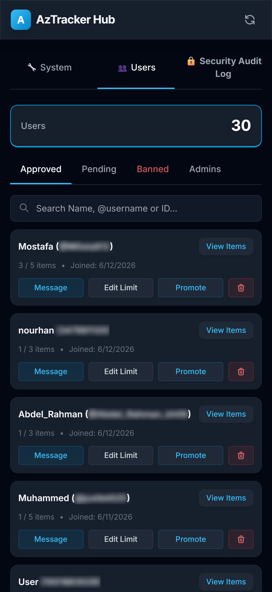 |  |
| **03. Pending Queue** Users awaiting admin approval to join the tracker. | 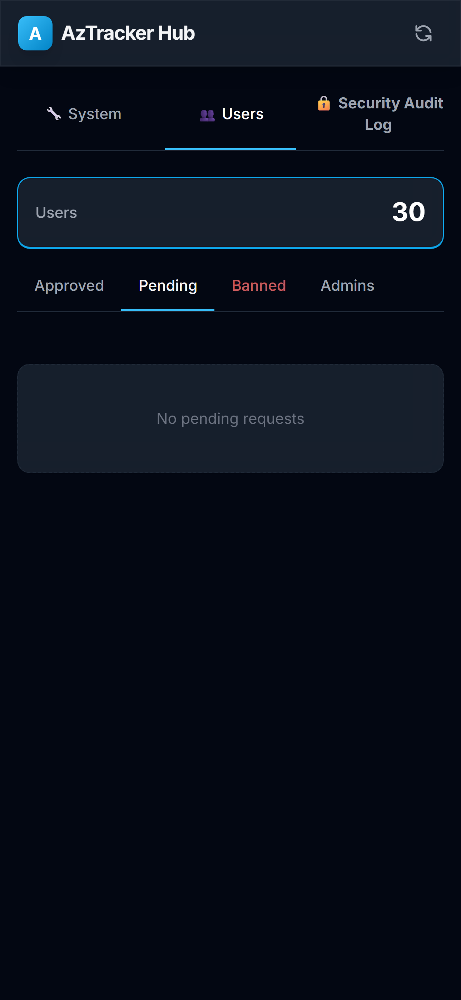 |  |
| **04. Banned Users** Users whose access has been permanently revoked. | 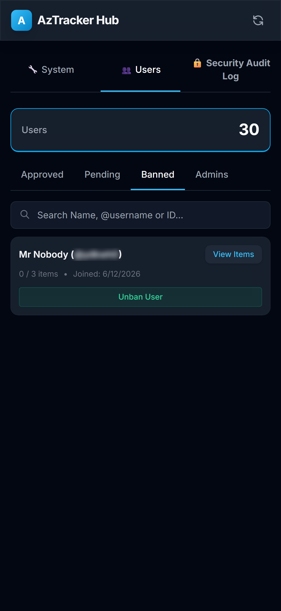 |  |
| **05. System Admins** Users with administrative access (Root vs Admin roles). | 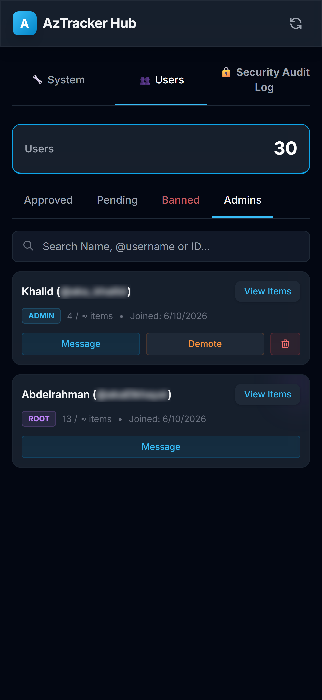 |  |
| **06. Security Audit Log** Timeline of all administrative actions. | 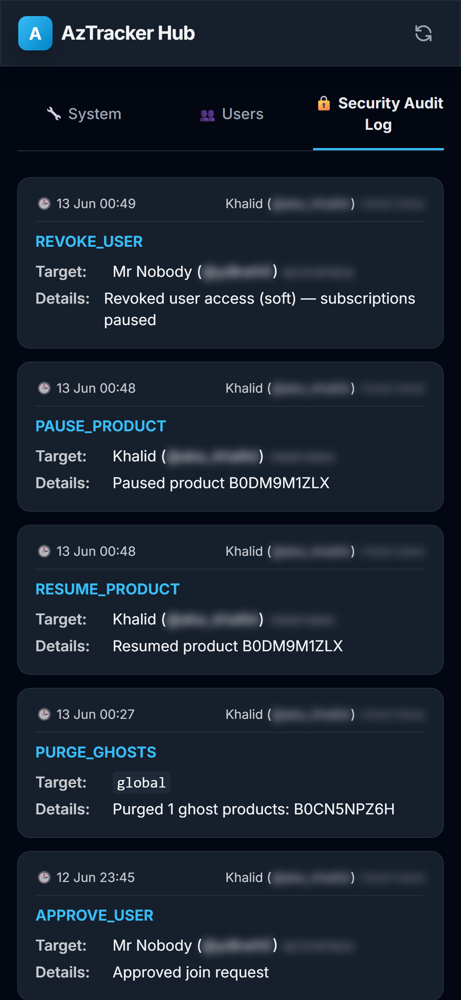 |  |
| **07. Active Products** Drawer showing all products currently being tracked. | 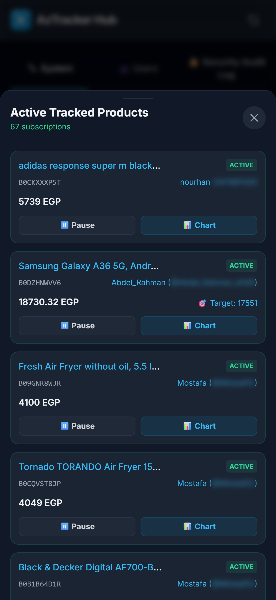 |  |
| **08. Top Charts** Drawer showing most popular products by subscriber count. | 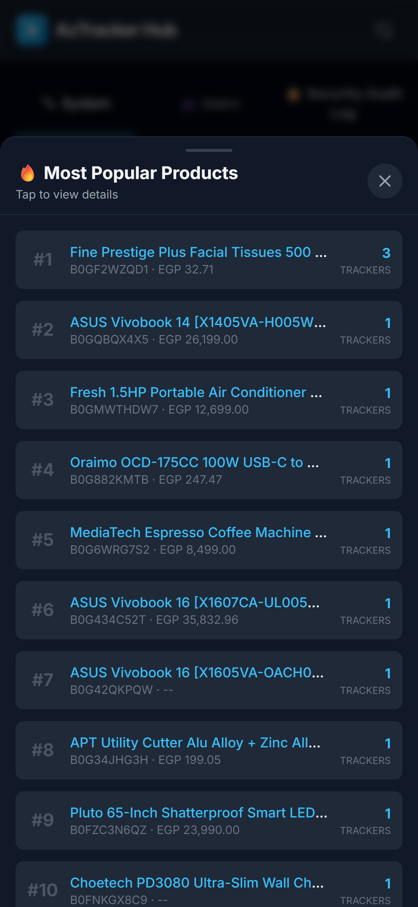 |  |
| **09. Paused Products** Items that users have temporarily stopped tracking. | 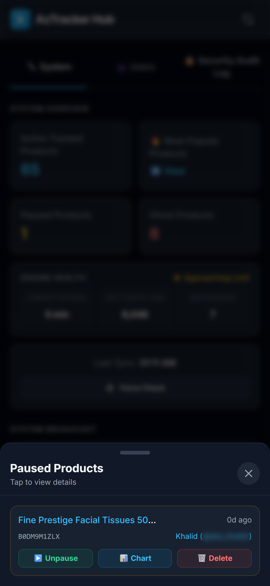 |  |
| **10. Ghost Graveyard** Delisted, out-of-stock, or heavily monitored items. | 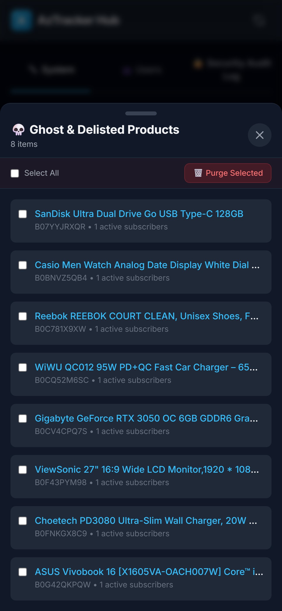 | 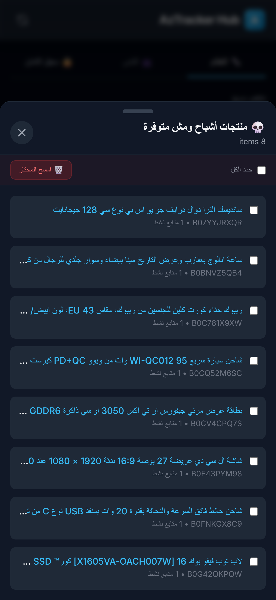 |
| **11. User Profile Items** Drawer displaying individual items tracked by a specific user. | 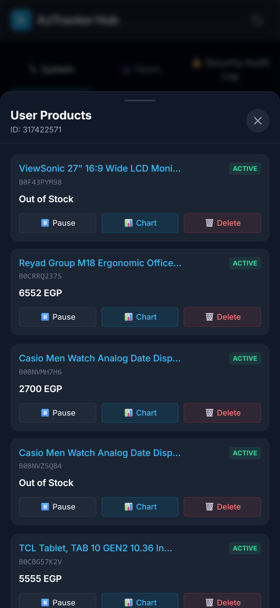 |  |
| **12. Product Subscribers** Drawer showing all users tracking a specific product. | 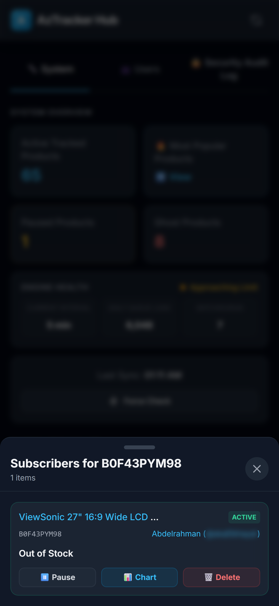 |  |
| **13. Price History Chart** Interactive Chart.js modal showing price trends over time. | 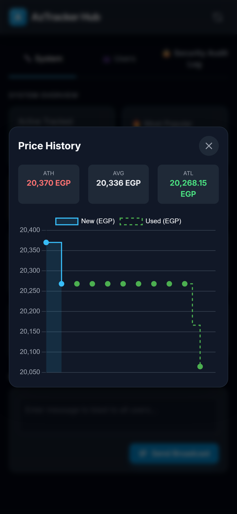 |  |

---
*Note: Usernames and Chat IDs have been automatically blurred for privacy.*
